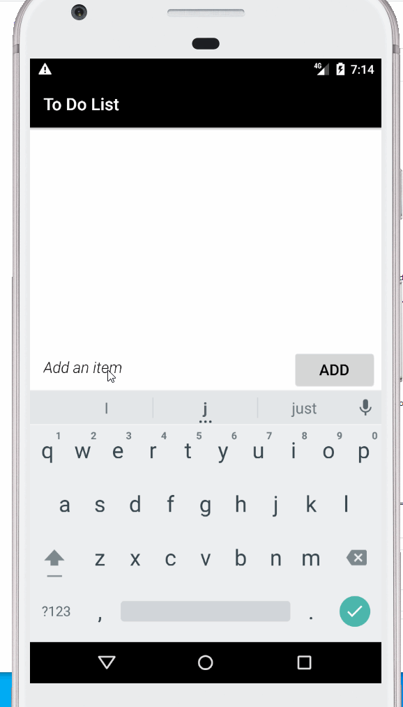

# Project 1 - *YYH Todolist*

**My todo list app** is an android app that allows building a todo list and basic todo items management functionality including adding new items, editing and deleting an existing item.

Submitted by: **YIHAN YANG**

## User Stories

The following **must have** functionality is completed:

* [x] User can **view a list of todo items**

* [x] User can **successfully add and remove items** from the todo list

* [x] User's **list of items persisted** upon modification and and retrieved properly on app restart

* [x] User can **tap a todo item in the list and bring up an edit screen for the todo item** and then have any changes to the text reflected in the todo list

 

The following **nice to have** features are implemented:

* [ ] Your app should allow you to mark items as completed.

* [ ] Your app should allow you to set items with a higher priority, and show it on the list.

* [x] Your app includes a improved UI (icons, styling, colors, etc.)

 

Here's a walkthrough of implemented user stories:

GIF created with [LiceCap](http://www.cockos.com/licecap/).
